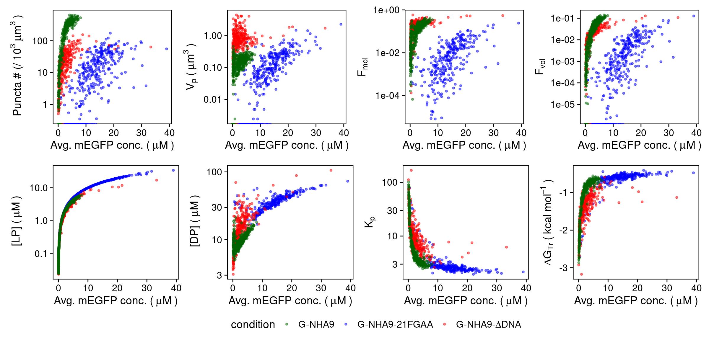

# Punctatools: quantification of puncta-like structures inside cells

This package provides tools to detect, colocalize, and quantify spots/puncta from 3D fluorescent images and summarize puncta characteristics for individual cells or nuclei.

Our [puncta detection pipeline](docs/puncta_segmentation.md) is based on the [scikit-image](https://scikit-image.org/) implementation of the Laplacian of Gaussian (LoG) filter with additional processing to segment and filter puncta. We provide a [setup notebook](notebooks/setup_puncta_analysis.ipynb) that guides the user through parameter adjustment for each step of the puncta detection pipeline, making the pipeline adaptable to various puncta types and image contrasts.

To quantify puncta properties per cell, we use [Cellpose](https://github.com/mouseland/cellpose) as the first step of the pipeline to [segment cells/nuclei](docs/roi_segmentation.md) from images of cell/nuclei-specific fluorescent marker. 

## Installation

**Option 1: conda installation**

Create a new conda environment with punctatools and all dependencies from the provided yml file: 
   
``conda env create -f punctatools.yml``

To overwrite an old environment with the same name, run the above command with the `--force` flag:

``conda env create -f punctatools.yml --force``

**Option 2: pip installation**

1. Create and activate a new [anaconda](https://docs.anaconda.com/anaconda/install/) 
   environment (optional): 
   ``conda create -n punctatools python=3.9; conda activate punctatools``
2. Install the punctatools package and dependencies:
    ``pip install git+https://github.com/stjude/punctatools.git@v0.1.1``

## Requirements

2D or 3D images that include channels for:

- fluorescently-tagged biomolecule(s) of interest that form(s) puncta-like / spot-like structures
- (optional) fluorescent marker specific to the region of interest, e.g. cell or nucleus

## Usage

### 1. Prepare the images for analysis

Images must be organized into z-stacks by combining all channels and z-layers from the same field-of-view.

**Option 1:**  If the acquisition software allow, creates a single z-stack per acquisition, 
which  combines all fluorescent channels into separate layers. 
Make sure that the image metadata includes the correct pixel size and z-spacing.

**Option 2**: Multiple positions or time points per file (e.g., Slidebook format).

Use the provided conversion macro 
(https://github.com/stjude/punctatools/blob/main/scripts/export_multipage.ijm)
to split images to individual positions. Open the macro in [Fiji](https://imagej.net/software/fiji/) 
and run it. When prompted, select the input (source) directory with the images to convert, 
and the output (target) directory to save the results 
(the output directory will need to be created beforehand).

**Option 3**: Individual files for each channel and z-layer.

Use the provided conversion notebooks to combine channels and z-layers into stacks.

1. Set up the parameters of the conversion with the 
[setup_images_to_stack.ipynb](notebooks/setup_images_to_stack.ipynb) notebook. 
Follow the instructions in the notebook.
   
2. Convert the entire dataset with the [run_images_to_stack.ipynb](notebooks/run_images_to_stack.ipynb) 
     notebook.
   
### 2. Segment ROI (cells or cell nuclei)

Follow this step if you wish to quantify puncta in individual ROIs (cells / nuclei)
 and your images contain a channel with a fluorescent label specific to this region of interest.
Otherwise, go to step 3.

1. Set up the [parameters](docs/parameters.md#list-of-parameters-for-ROI-segmentation) of the cell segmentation with the 
    [setup_roi_segmentation.ipynb](notebooks/setup_roi_segmentation.ipynb) notebook. 
    Follow the instructions in the notebook.
2. Segment the entire dataset with the [run_roi_segmentation.ipynb](notebooks/run_roi_segmentation.ipynb) 
     notebook.
   

### 3. Segment and quantify puncta

1. Set up the [parameters](docs/parameters.md#list-of-parameters-for-puncta-segmentation-and-analysis) of the puncta analysis with the 
    [setup_puncta_analysis.ipynb](notebooks/setup_puncta_analysis.ipynb) notebook. 
    Follow the instructions in the notebook.
2. Analyze the entire dataset with the [run_puncta_analysis.ipynb](notebooks/run_puncta_analysis.ipynb) 
     notebook. This will generate quantification for [individual puncta](docs/outputs.md#measurements-for-individual-puncta) and [individual ROI](docs/outputs.md#measurements-for-individual-roi).
   

### 4. Thermodynamic characterization

If you wish to calculate additional puncta and thermodynamic features from the output files 
([puncta_quants.csv](example_data/thermodynamic_characterization/puncta_quants.csv) and 
[cell_quants.csv](example_data/thermodynamic_characterization/cell_quants.csv) 
from <strong>Step 3. Segment and quantify puncta</strong>), 
use the provided R Markdown notebook [puncta_thermo_calc.Rmd](scripts/thermodynamic_characterization/puncta_thermo_calc.Rmd). 
The notebook calculates the number of puncta, nuclear volume (x 103), average puncta volume (**Vp**),
mole fraction (**Fmol**), 
volume fraction (**Fmol**), light phase (**[LP]**), puncta dense phase (**[DP]**), 
partiton coefficient (**Kp = [DP] / [LP]**) and transfer free energy 
(**Δ GTr = - RT ln Kp**). 
**R** is the gas constant in (kcal/mol)/K and **T** is the temperature in Kelvin.  
 
The [puncta_thermo_calc.Rmd](scripts/thermodynamic_characterization/puncta_thermo_calc.Rmd) 
notebook should work with RStudio and R version 4.1.0.

### Batch processing

There are two options to run analysis in the batch mode.

**Option 1**: use the provided notebooks ([run_images_to_stack.ipynb](notebooks/run_images_to_stack.ipynb),
[run_roi_segmentation.ipynb](notebooks/run_roi_segmentation.ipynb), 
and [run_puncta_analysis.ipynb](notebooks/run_puncta_analysis.ipynb)) after setting up the parameters 
with the corresponding setup notebooks, as described above

**Option 2**: instead of notebooks, you can use the script versions of the batch analysis: 
[run_images_to_stack.py](scripts/run_images_to_stack.py), 
[run_roi_segmentation.py](scripts/run_roi_segmentation.py), and 
[run_puncta_analysis.py](scripts/run_puncta_analysis.py). 
You can run the scripts with the following command:

``python <script_name> -p <parameter_file>``

where `<script_name>` is the name of the script (with the path), and `<parameter_file>` 
is the json file with parameters generated after running the corresponding setup notebook.

Example:

``python run_puncta_analysis.py -p parameters.json``

## Issues

If you encounter any bugs or have a feature request, please open an [Issue](https://github.com/stjude/punctatools/issues).

If you have a question, you may ask it [here](https://github.com/stjude/punctatools/discussions)

## Citation

If you find this package useful, please cite:

> David W. Baggett, Anna Medyukhina, Swarnendu Tripathi, Hazheen K. Shirnekhi, 
> Huiyun Wu, Stanley B. Pounds, Khaled Khairy and Richard Kriwacki. 
> *An Image Analysis Pipeline for Quantifying the Features of Fluorescently-Labeled Biomolecular Condensates in Cells*.
> Frontiers in Bioinformatics (2022) 
> [https://doi.org/10.3389/fbinf.2022.897238](https://doi.org/10.3389/fbinf.2022.897238)

