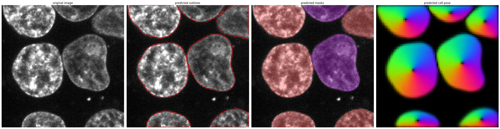
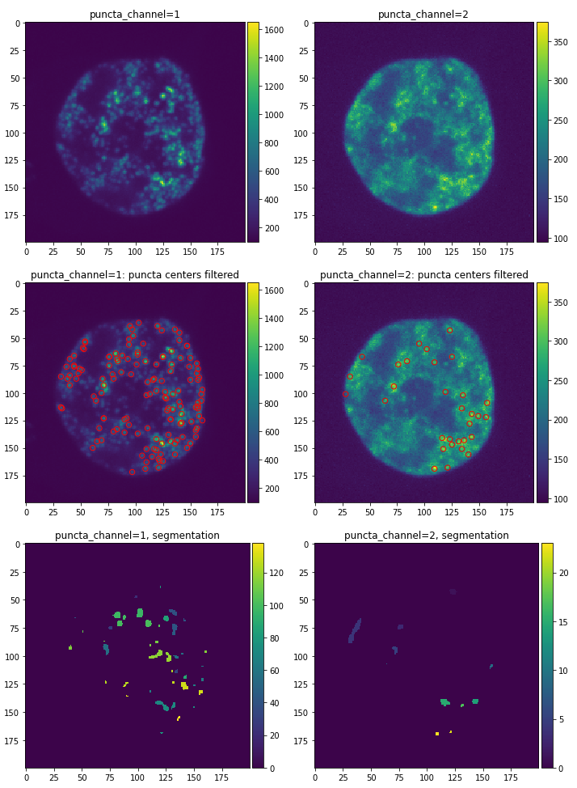

# Image analysis of fluorescently tagged biomolecular condensates

## Installation

**Option 1:**

1. Download the latest version of the package
2. cd into the package directory
3. Install the package by running `pip install .`
    
You can install the punctatools into your base python environment, but we recommend creating 
a new [anaconda](https://docs.anaconda.com/anaconda/install/) 
or [mamba](https://github.com/mamba-org/mamba) environment. 

This installation should work with python versions 3.7-3.9.

**Option 2:**

Create a new conda environment with all dependencies from the provided yml file: 
   
`conda env create -f punctatools.yml`

To overwrite an old environment with the same name, run the above command with the `--force` flag:

`conda env create -f punctatools.yml --force`

## Usage

### 1. Prepare the images for analysis

Images must organized into z-stacks by combining all channels and z-layers from the same field-of-view.

**Option 1:**  If the acquisition software allow, creates a single z-stack per acquisition, 
which  combines all fluorescent channels into separate layers. 
Make sure that the image metadata includes the correct pixel size and z-spacing.

**Option 2**: Multiple positions or time points per file (e.g., Slidebook format).

Use the provided conversion macro 
(https://github.com/stjude/punctatools/blob/main/scripts/export_multipage.ijm)
to split images to individual positions. Open the macro in [Fiji](https://imagej.net/software/fiji/) 
and run it. When prompted, select the input (source) directory with the images to convert, 
and the output (target) directory to save the results 
(the output directory will need to be created beforehand).

**Option 3**: Individual files for each channel and z-layer.

Use the provided conversion notebooks to combine channels and z-layers into stacks.

1. Set up the parameters of the conversion with the 
[setup_images_to_stack.ipynb](notebooks/setup_images_to_stack.ipynb) notebook. 
Follow the instructions in the notebook.
   
2. Convert the entire dataset with the [run_images_to_stack.ipynb](notebooks/run_images_to_stack.ipynb) 
     notebook.
   
### 2. Segment ROI (cells or cell nuclei)

Follow this step if you wish to quantify puncta in individual ROIs (cells / nuclei)
 and your images contain a channel with a fluorescent label specific to this region of interest.
Otherwise, go to step 3.

1. Set up the parameter of the cell segmentation with the 
    [setup_roi_segmentation.ipynb](notebooks/setup_roi_segmentation.ipynb) notebook. 
    Follow the instructions in the notebook.
2. Segment the entire dataset with the [run_roi_segmentation.ipynb](notebooks/run_roi_segmentation.ipynb) 
     notebook.
   

### 3. Segment and quantify puncta

1. Set up the parameter of the puncta analysis with the 
    [setup_puncta_analysis.ipynb](notebooks/setup_puncta_analysis.ipynb) notebook. 
    Follow the instructions in the notebook.
2. Analyze the entire dataset with the [run_puncta_analysis.ipynb](notebooks/run_puncta_analysis.ipynb) 
     notebook.
   

### Batch processing

There are two options to run analysis in the batch mode.

**Option 1**: use the provided notebooks ([run_images_to_stack.ipynb](notebooks/run_images_to_stack.ipynb),
[run_roi_segmentation.ipynb](notebooks/run_roi_segmentation.ipynb), 
and [run_puncta_analysis.ipynb](notebooks/run_puncta_analysis.ipynb)) after setting up the parameters 
with the corresponding setup notebooks, as described above

**Option 2**: instead of notebooks, you can use the script versions of the batch analysis: 
[run_images_to_stack.py](scripts/run_images_to_stack.py), 
[run_roi_segmentation.py](scripts/run_roi_segmentation.py), and 
[run_puncta_analysis.py](scripts/run_puncta_analysis.py). 
You can run the scripts with the following command:

``python <script_name> -p <parameter_file>``

where `<script_name>` is the name of the script (with the path), and `<parameter_file>` 
is the json file with parameters generated after running the corresponding setup notebook.

Example:

``python run_puncta_analysis.py -p parameters.json``

